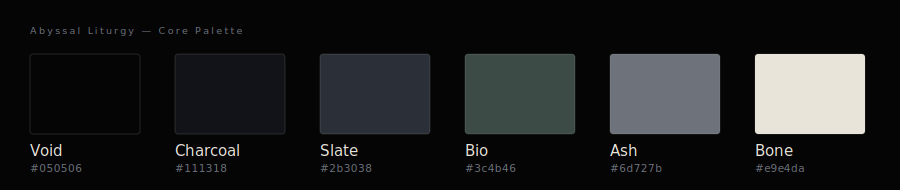
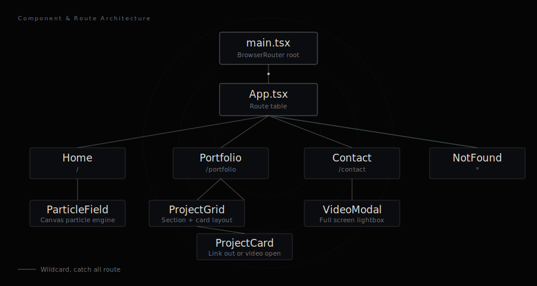
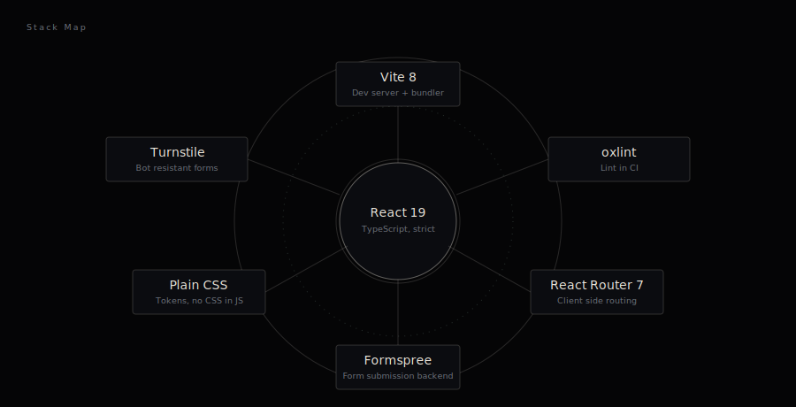
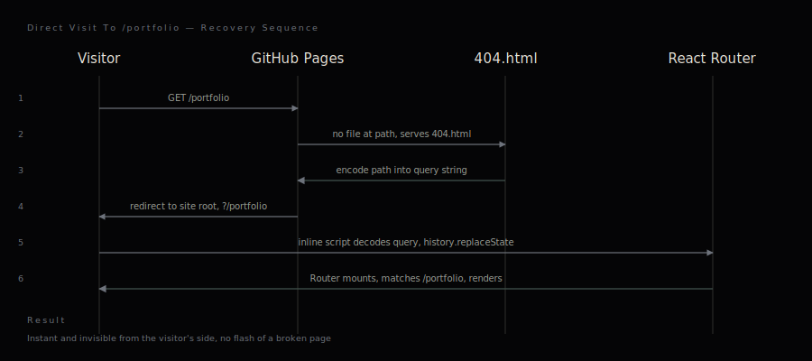

<div align="center">


<br />

[](https://hassanireza.github.io/)
[](.github/workflows/ci.yml)
[](#stack)
[](#license)
[](docs/brand/brandbook.html)

</div>

<br />

This repository is the source of a personal site, engineered as a fully typed, statically deployed single page application. It is not open for contribution. It exists as a public reference and a demonstration of production discipline applied to a small, deliberately scoped codebase, one that now carries a portfolio, an interactive roadmap, and a public learning tracker under a single design system.

**Live site:** [hassanireza.github.io](https://hassanireza.github.io/)
**Brand system:** [Abyssal Liturgy Brandbook](docs/brand/brandbook.html) · [hassanireza.github.io/branding](https://hassanireza.github.io/branding)

---

## Overview

One design language, several distinct experiences, all in one app.

| Route | Purpose |
|---|---|
| `/` | Landing page, canvas based particle field animation |
| `/portfolio` | Portfolio work, grouped by category |
| `/branding` | The Abyssal Liturgy brand system, published in full |
| `/contact` | Contact form, Cloudflare Turnstile verified |
| `/descent` | The Descent, an immersive scroll driven career roadmap |
| `/descent/cv` | Printable CV, reached from The Descent |
| `/journey` | My Journey, a self graded skill tree and progress tracker |
| `/journey/roadmap` | The full phase by phase roadmap and achievements |
| `/journey/cheatsheets` | A catalog of long form reference guides |
| `/journey/cheatsheets/:slug` | An individual reference guide |
| `*` | Branded 404, catch all for unmatched paths |

The visual identity across every route, component, and diagram in this repository follows a single system: **Abyssal Liturgy**, a near monochrome dark palette carried by Fraunces for display type, a geometric sans for body copy, and JetBrains Mono for annotation. The full specification lives in [`docs/brand/brandbook.html`](docs/brand/brandbook.html); the tokens that implement it in code live in `src/styles/tokens.css`. Every route, including the two larger sub-applications merged into this repository, resolves its type, color, and icon language from that same token file, and every route carries its own tab icon drawn from the same mark system.

<div align="center">
  
</div>

### Component and route architecture



`App.tsx` holds the complete route table. The Home, Portfolio, Contact, Branding, and NotFound pages each own their own stylesheet and compose from a small, shared component set: `ProjectCard`, `ProjectGrid`, `VideoModal`, `ParticleField`. The Descent and Journey sections are each self contained beneath their own `pages/` subtree, their own components, hooks, and domain logic, scoped under a wrapper class so their styling can never leak into the rest of the site. Cross cutting logic, project data, asset path resolution, and design tokens, is defined once and imported wherever it is needed. Nothing is duplicated per page.

---

## Stack



- **React 19** with **TypeScript**, strict mode enforced
- **React Router 7**, client side routing, including nested routes for The Descent and My Journey
- **Vite 8**, both the development server and the production bundler
- **GSAP**, driving the scroll physics and motion in The Descent
- **oxlint**, fast linting, wired into CI
- Plain CSS per component and page, no CSS in JS, no utility framework, a single shared token file
- **Cloudflare Turnstile**, bot resistant form verification
- **Formspree**, the form submission backend

No global state library is present. State is local to each page, `useState` and `useEffect`, which is sufficient for an application of this scope. This is a decision, not an omission.

---

## Project structure

```
src/
  data/
    projects.ts             Portfolio entries
    brandSystem.ts           Brand page content
  types/
    project.ts               Project, LinkProject, AnimationProject
  lib/
    asset.ts                  Resolves image and video paths, base aware
  hooks/
    useRouteFavicon.ts         Per-route tab icon, drawn from the mark system
  components/
    ParticleField/             Canvas particle engine
    ProjectCard/                Single portfolio card, link out or video open
    ProjectGrid/                 Section heading plus a grid of cards
    VideoModal/                   Full screen animation lightbox
    ScrollToTop/                   Resets scroll position on route change
  pages/
    Home/                       Landing page, particle hero, primary navigation
    Portfolio/                   Portfolio grid page
    Contact/                      Contact form, Turnstile integration
    Branding/                      Published brand system page
    NotFound/                      Branded 404 page, catch all route
    Descent/                       The Descent: scroll driven roadmap and CV
    Journey/                       My Journey: skill tree, achievements, cheat sheet library

public/
  404.html                    GitHub Pages SPA redirect shim
  assets/                      Static images, video, per-route favicons
  journey/                      Cheat sheet guides and progress data for My Journey

docs/
  diagrams/                    Source SVGs referenced in this README
  brand/
    brandbook.html               Abyssal Liturgy brand system, full reference
```

---

## Routing on a static host

GitHub Pages has no server side routing. A hard refresh or a direct link to a nested path, `/descent/cv` or `/journey/roadmap`, would 404 on a naive static deployment, since no file exists at that path. This project resolves that with the established `rafgraph/spa-github-pages` pattern, adapted for this repository.



In short: `public/404.html` intercepts the request GitHub Pages could not resolve, encodes the intended path into a query string, and redirects to the site root. The inline script in `index.html` decodes that query string and restores the real path with `history.replaceState`, before React Router mounts. From the visitor's perspective, this is instant and invisible.

Because `404.html` redirects before anything renders, it is not the page a visitor actually sees for a broken link. That page is `src/pages/NotFound/NotFound.tsx`, rendered by the wildcard `*` route in `App.tsx`, styled to match the rest of the site.

---

## Contact form and Turnstile

The contact form posts to Formspree and is protected by Cloudflare Turnstile, an invisible or lightweight challenge that replaces a traditional CAPTCHA.

`src/pages/Contact/useTurnstile.ts` is a small hook that:

- Loads the Turnstile script once and reuses it across remounts, rather than injecting it repeatedly.
- Guards against rendering a second widget into a container that already holds one. This matters in development, where React Strict Mode intentionally double invokes effects to surface exactly this class of bug.
- Exposes the verification token and a `reset()` function, called after a submission succeeds or fails, so the widget is ready for a second attempt.

---

## Brand system

Every visual surface in this repository, the live site, the README diagrams, and the badges above, draws from a single named system: **Abyssal Liturgy**. The full brandbook, palette, type scale, logo marks, and usage guidance, is included at [`docs/brand/brandbook.html`](docs/brand/brandbook.html) and published at [hassanireza.github.io/branding](https://hassanireza.github.io/branding).

| Token | Hex | Role |
|---|---|---|
| Void | `#050506` | Primary background |
| Charcoal | `#111318` | Secondary surface |
| Slate | `#2b3038` | Borders, dividers |
| Bio | `#3c4b46` | Accent, sparing use |
| Ash | `#6d727b` | Secondary text, annotation |
| Bone | `#e9e4da` | Primary text, foreground |

Diagram source files are plain SVG, styled with these tokens directly, kept under `docs/diagrams/` and version controlled alongside the code they describe. The same restraint carries into The Descent and My Journey: no product logos, no per-category color coding, a single line-icon vocabulary shared across every route.

---

## License

Personal project. Source is public for reference only. Portfolio content, copy, and imagery are not licensed for reuse.
